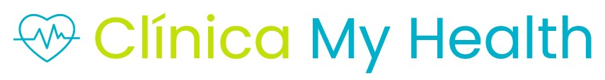

# Clínica My Health
***

 
 

<!-- MyHealth nos ayuda para que podamos tener citas medicas online.

Para levantar el prototipo simplemente necesita la extension de VS Code llamada liveshare y podra ejecutar el prototipo si mayores complicaciones. -->
